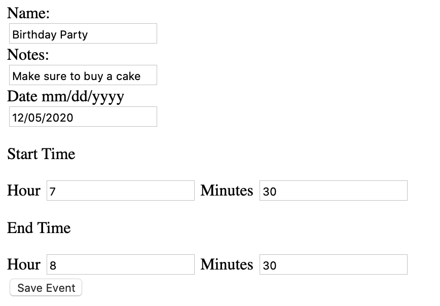
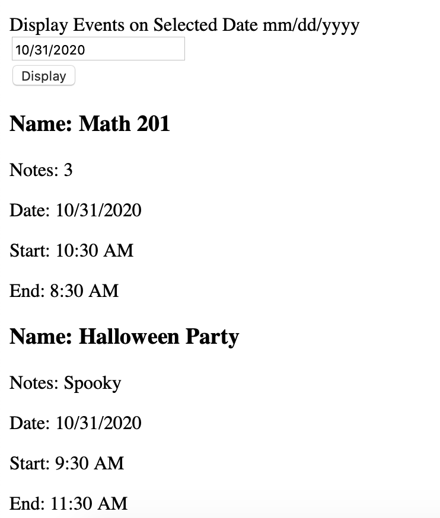

# Firebase Calendar Prototype

## Overview
This program demonstates how to save calender events in firebase and query for events on a specific date. The program uses a basic html template to input and outout information. Eventually a web app using vue.js will be built around the js code. 

Fill out the for and click save event to create a new event. Type in a date and click display to show all the events for that date.

 
 

## Setup 
This uses client said javascript to communicate to firebase. To use this project, follow the instruction [here](https://firebase.google.com/docs/web/setup) to set up a firebase database. Make sure to follow the web instructions for hosting urls. Then create a file named config.js and add it to the project. Copy and paste the firebaseConfig information given to you in set up. The app should work once index.html is opened in a web browser.

All the necessary libraries are continued in the HTMl. 

## Used Commands
This program uses set, update, get, and docchanges from the firebase library. 

## Helpful Websites
[Firebase Documentation](https://firebase.google.com/docs/reference/js)
